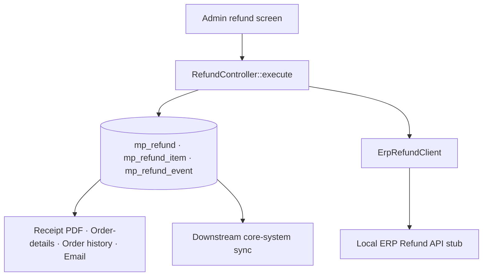

# Architecture Overview

| Item | Value |
| --- | --- |
| Subsystem | `Acme_SellerRefund` |
| Status | Proposed design, approaching implementation sign-off |
| Runtime | Magento Open Source 2.4.7-p10; PHP 8.3; MariaDB 10.11 |
| Search | OpenSearch 2.12 (ICU + Kuromoji); Magento core adapter |
| Local services | File-backed cache/session; **no AMQP broker configured**; Node.js **ERP Refund API** stub |
| Store | `ja_JP`, JPY, `Asia/Tokyo`; child theme on `Magento/blank` |
| Expected scale | ≈250,000 orders and ≈5,000 refunds per month; campaign peak ≈25 submissions/minute; ≈40 concurrent worklist operators; ≈20,000 rows/day considered by settlement |

> This note describes how the seller Return & Refund subsystem is put together today, so the next phase can extend it. It is written for design sign-off. The company, the ERP, its identifiers, and all data are synthetic; the ERP is a local stub.

---

## 1. Goals and boundaries

An operator works entirely inside the Magento Admin: a refund-entry screen backed by an admin controller, a service that calculates and persists the refund, an ERP Refund API client that registers the refund as a pending credit note against the seller ledger, and a worklist grid the operator works through the day. Refunded amounts are then rendered on four customer-facing surfaces and pushed to the downstream core system.

Bank execution, returns logistics, and first-party (non-seller) refunds are out of scope. The original order and invoice totals are never mutated.

The Admin controller is the orchestration boundary: it validates the request, loads the order, calculates line and header amounts, writes the refund and event records, calls the ERP, and returns a combined result to the browser. This keeps the first release inside one module and avoids adding a queueing dependency.

---

## 2. Frontend (operator screen)

The refund-entry screen is a Knockout/jQuery admin view. The operator selects seller lines and quantities, the screen totals them client-side, and **Submit** posts the refund to the controller.

To keep the screen feeling responsive, on **Submit** the UI immediately marks the row **Refunded** and renders the success state, then the request completes in the background. The operator can move on without waiting for the round trip; the submit control stays available while the request is in flight so the operator can re-press it if the browser feels slow.

The worklist and the entry screen keep themselves current by **polling the refund-status endpoint every two seconds**, so an operator always sees fresh sub-status values as the ERP calls progress. Refreshing the page reloads the latest server state.

---

## 3. Backend (service and persistence)

`RefundController::execute` receives the post, builds the refund from the request, calculates the amounts and tax, writes `mp_refund` and the `mp_refund_item` rows, and calls the ERP Refund API — all within the admin request. The controller holds the orchestration: validation, calculation, persistence, and the Create Refund call are sequenced there so the flow is easy to follow in one place.

The status lifecycle is enforced in PHP: the service reads the current `status` and sets the next one before each transition. The `status` column is a plain `varchar` holding the current value; the allowed transitions live in the service's transition method. New states can be added without a schema migration.

Create Refund is called **synchronously** inside the same admin request, right after the database write, so the operator gets the ERP outcome in the same response and the record is fully progressed by the time the screen returns. (The platform declares no message broker in this runtime; the flow does not use one.)

Money columns are `decimal(20,4)`. The header stores subtotal, shipping, tax, and grand total; each line stores unit price, requested quantity, previous refunded quantity, tax rate, tax amount, and total at submission time.

---

## 4. Integration (ERP Refund API client)

`ErpRefundClient` wraps the three operations — Create Refund, Read Refund Status, Confirm Refund — each a synchronous HTTP call with a 30-second timeout followed by two immediate retries. On a failure the client throws; the service catches, writes the sub-status, and returns.

For Create Refund, the client rebuilds its request from the current record on each attempt and stamps a fresh request identifier per attempt. Retries are driven from the worklist: an operator can re-run a failed call from the grid, which re-invokes the client for that record.

Response handling maps ERP responses to outcomes:

| Result | Handling |
| --- | --- |
| 2xx | Record success and advance the lifecycle |
| 4xx, including **429** | Mark the operation and the refund `failed`; the operator investigates |
| 5xx or timeout | Retry twice in the request, then mark `failed` |

Confirmation is a **per-refund synchronous loop**: after the cash refund is registered, the client calls Read Refund Status every two seconds for up to 30 seconds until it sees the pending state, then calls Confirm Refund. Request and response payloads are appended to `mp_refund_event`. There is no separate queue, dead-letter store, or replay path; the record itself, with its sub-status fields, is the retry surface.

---

## 5. Performance (the two hot paths)

**The worklist.** The grid loads the operator's open refunds by fetching the refund collection and, for each refund, loading its order and its lines to display seller, SKU, and amounts. It renders the full working set; there is no server-side aggregation, and the per-row order/line reads happen as the grid iterates. The result is not cached, because operators require current status. The worklist read is computed fresh on every load.

**The settlement sweep.** A daily process scans refunds in `cash_refunded` to drive confirmation and export. It selects across `mp_refund` filtered by status and date, walks the matching rows, and reads the most recent event per refund. The columns it filters on are not specifically indexed beyond the primary key and the unique `refund_no`; the scan relies on the table staying small.

At the expected monthly volume, ordinary worklist requests are estimated to stay under one second and the settlement command under ten minutes.

---

## 6. Presentation of refunded amounts

The refund total and the refund-details block appear on four surfaces and the downstream sync: the reissued receipt PDF (which doubles as the qualified tax invoice), the order-details screen, order history, and the confirmation email, plus the downstream core-system export.

Each surface builds the figures where it renders them. The receipt generator computes the pre-refund total, the refund breakdown, and the tax split from the refund and order records as it lays out the PDF. The order-details block derives the same figures in its view model. Order history formats its own summary line. The email template assembles the breakdown from the refund record when the mail is built. The downstream mapper composes its own payload from the refund record. Keeping each channel-specific avoids coupling the PDF, storefront, email, and integration layers to one presentation DTO, so each surface stays independent and easy to change on its own.

---

## 7. Assumptions for sign-off, and next phase

The v1 design favours simplicity and a single request path. The following are the known items the next phase should revisit; they are sized for current volume and are expected to feel pressure first as volume and operator count grow:

- the two-second status poll across many concurrent operator sessions;
- the per-row order/line reads in the worklist grid; and
- additional indexes on the settlement scan, to be added once production query telemetry is available.

Further assumptions the sign-off rests on: the ERP normally responds within five seconds; a maximum of forty operators use the worklist concurrently; the daily settlement run scans no more than twenty thousand candidate rows; ERP retries are rare enough that synchronous execution will not exhaust PHP workers; and the channel-specific presentation logic will stay aligned through shared acceptance tests.

The next phase should also settle the concurrency mechanism for the "one active refund per order" invariant, which v1 leaves to the application layer.

---

*This document is the current-state reference. The next-phase design should extend it, not replace it wholesale.*
